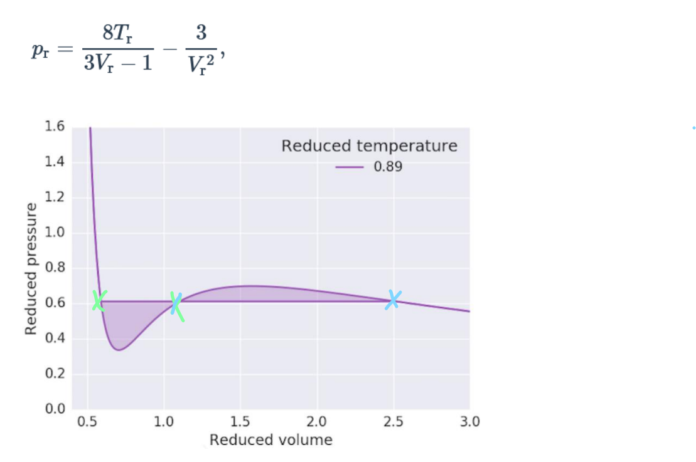

```{https://physics.ujep.cz/~jskvor/NME/NUM-24-01-31.pdf}
```



```{r}
p <- function(Vr, Tr = 0.89) {
  (8 * Tr) / (3 * Vr - 1) - 3 / (Vr^2)
}

Bisekce <- function(f,a,b){
  if(f(a)*f(b) < 0){
    fa <- f(a)
    fb <- f(b)
    repeat{
      c <- (a+b)/2
      if(c == a || c == b) break
      fc <- f(c)
      if(fa*fc < 0){
        b <- c
        fb <- fc
      }else{
        a <- c
        fa <- fc
      }
    }
  }else{
    print("Mas blbe vstup.")
  }
  return(c)
}

MidPointRule <- function(f, a, b, n = 1){
  h <- (b-a)/n
  return(h*sum(f(a+h*(1:n)-h*0.5)))
}
MidPointRuleRichardson <- function(f, a, b, n = 1){
  res <- sapply(2^(0:(n-1)), function(n) MidPointRule(f, a, b, n))
  if(n > 1){
    for(i in 1:(n-1)){
      m <- n-i+1
      power <- 4^i
      res <- (power*res[2:m]-res[1:(m-1)])/(power-1)
    }
  }
  return(res)
}

Bisekce(
  function(x) {
  a <- Bisekce(function(V) p(V)-x, 0.5, 0.8)
  b <- Bisekce(function(V) p(V)-x, 2, 10)
  return(MidPointRuleRichardson(function(V) p(V)-x, a, b, 8))
 }, 0.6, 0.62)
```

```{https://physics.ujep.cz/~jskvor/NME/NUM-24-02-16.pdf}
```

```{r}
Bisekce(function(p) MidPointRuleRichardson(function(alpha) MidPointRuleRichardson(function(x) exp(-alpha*x)*sin(x), 0, 2*pi, 8), 2, 20, 8), 0.6, 0.62)
```
