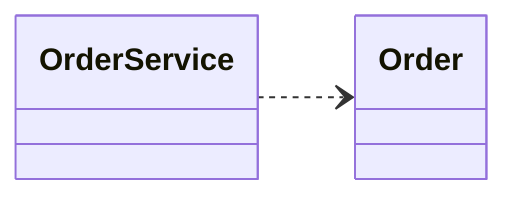
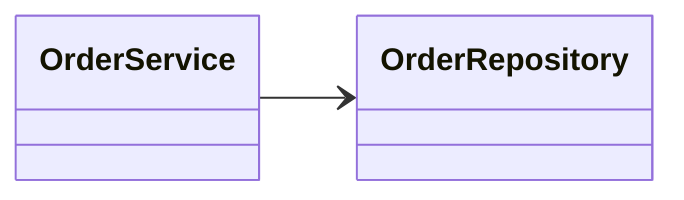
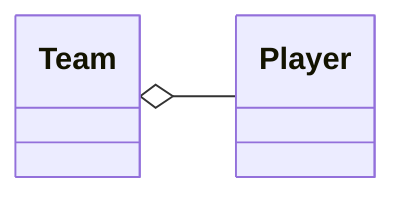
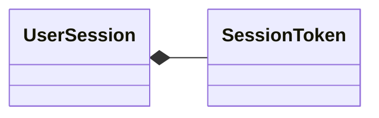
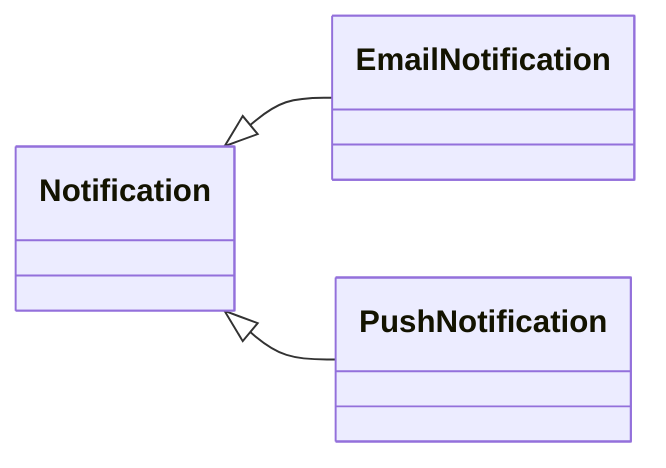
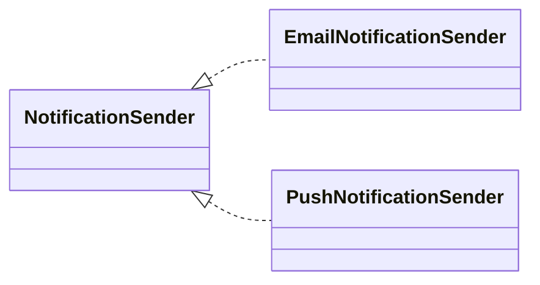

## OOD

### Užitečné odkazy
- https://www.visual-paradigm.com/guide/
- https://www.umlboard.com/docs/relations/
- https://plantuml.com/sitemap
- https://real-world-plantuml.com/

### Systém
- soubor vzájemně propojených prvků, které tvoří uspořádaný celek, pracující společně k dosažení určitého cíle
- prvky v systému nejsou náhodné, ale jsou spojeny vztahy a fungují koordinovaně
- příklady: lidské tělo (orgánový systém), počítač (operační systém)

### Hranice systému
- pomyslná čára, která odděluje systém od jeho okolí
- určuje, co ještě systém řeší a co už řeší jiný systém (vymezuje odpovědnost systému)
- určuje, odkud přicházejí vstupy a kam odcházejí výstupy
- chrání návrh před neřízeným rozšiřováním

### Systémové modelování
- tvorba abstraktních modelů systémů pomocí grafických jazyků (např. UML) a metod, které umožňují pochopit, analyzovat a navrhovat řešení tím, že zjednodušují realitu a odhalují mezi prvky systému klíčové vztahy

### UML
- Unified Modeling Language
- standardizovaný grafický jazyk pro modelování (nejen softwarových) systémů
- smyslem je sjednotit způsob, jak lidé přemýšlejí a mluví o systému, ještě před jeho implementací
- definuje používané pojmy, symboly a vztahy
- vztahy nejsou vlastnosti dvojice tříd, ale vlastnosti modelovaného kontextu
- vztahy nejsou absolutní vlastností tříd, ale vyjadřují význam vztahu v konkrétním modelovaném kontextu
- umožňuje popsat systém jednotným způsobem

### UML vztahy


### Závislost 
- anglicky: dependency
- vyjadřuje dočasnou závislost, kdy jeden prvek používá jiný prvek ke splnění své úlohy, ale není s ním trvale svázán a neřídí jeho existenci

```csharp
class OrderService
{
    public void Create(Order order)
    {
        Console.WriteLine(order.Id);
    }
}
```

OrderService závisí na Order, ale neukládá si ho ani nevlastní jeho životní cyklus.

### Asociace
- anglicky: association
- vyjadřuje trvalý vztah spolupráce mezi prvky
- prvky existují nezávisle na sobě
- jeden prvek udržuje referenci na druhý a používá ho při své činnosti
- neřídí ani neovlivňuje životní cyklus asociovaného prvku, pouze způsob, jak s ním pracuje

```csharp
class OrderService
{
    private readonly OrderRepository _orderRepository;

    public OrderService(OrderRepository orderRepository)
    {
        _orderRepository = orderRepository;
    }
}
```

OrderService má k dispozici OrderRepository, se kterým opakovaně pracuje, ale nijak neřeší, kdy vznikne ani kdy zanikne.

### Agregace
- anglicky: aggregation
- vyjadřuje vztah celek–část, ve kterém části existují nezávisle na celku a nejsou jím vlastněny
- něco někam patří (hráč do týmu), ale není na tom existenčně závislé (hráč může v rámci systému existovat i mimo tým)

```csharp
class Team
{ 
    public List<Player> Players { get; } = [];
}
```

Team si udržuje seznam Player, ale samotní hráči nejsou vytvářeni ani ničeni týmem a mohou existovat i mimo něj.

### Kompozice
- anglicky: composition
- vyjadřuje vztah celek–část, ve kterém část nemůže existovat bez celku a sdílí s ním životní cyklus
- něco je vnitřní součástí něčeho jiného a bez toho nemůže existovat

```csharp
class UserSession
{
    public SessionToken Token { get; }

    public UserSession(string userId)
    {
        Token = new SessionToken(UserId: userId, IssuedAt: DateTime.UtcNow);
    }
}
```

UserSession vlastní a vytváří SessionToken, který existuje pouze jako její vnitřní součást.

### Generalizace
- anglicky: generalization
- vyjadřuje vztah, kdy jeden prvek je specializovaným typem obecnějšího prvku a přebírá jeho vlastnosti a chování

```csharp
abstract class Notification
{
    public Guid UserId { get; }

    protected Notification(Guid userId)
    {
        UserId = userId;
    }
}

class EmailNotification : Notification
{
    public EmailNotification(Guid userId) : base(userId) { }
}

class PushNotification : Notification
{
    public PushNotification(Guid userId) : base(userId) { }
}
```



### Realizace
- anglicky: Realization
- popisuje vztah, kdy prvek implementuje rozhraní a tím plní definovaný kontrakt

```csharp
interface INotificationSender
{
    Task SendAsync(Guid userId, string message);
}

class EmailNotificationSender : INotificationSender
{
    public async Task SendAsync(Guid userId, string message) { }
}

class PushNotificationSender : INotificationSender
{
    public async Task SendAsync(Guid userId, string message) { }
}

```

INotificationSender určuje, jakou operaci musí odesílači notifikací poskytovat, zatímco konkrétní odesílači řeší pouze její provedení, bez sdílení stavu a bez dědění dat.

### UML diagramy
- standardizované grafické modely, které popisují strukturu a chování systému z různých pohledů za účelem jeho pochopení a návrhu

### Typy UML diagramů


### Strukturální
- odpovídají na otázku: Z čeho se systém skládá a jaké jsou mezi prvky vztahy?
- popisují statickou strukturu systému
- př.: u e-shopu popisují, že existují zákazníci, produkty, košík, objednávky a že jsou mezi nimi nějaké vztahy

### Behaviorální
- odpovídají na otázku: Co systém dělá, kdy a v jakém pořadí?
- popisují chování systému v čase
- př.: u e-shopu popisují, jak a kdy zákazník přidá produkt do košíku, odešle objednávku, proběhne platba, ...

### Diagram případů užití
- anglicky: Use Case Diagram
- popisuje, jaké funkce systém poskytuje jednotlivým aktérům a jak s nimi interagují
- slouží k vymezení požadavků na systém a k dohodě mezi zadavatelem, uživateli a vývojáři
- používá se na začátku analýzy, kdy se ještě neřeší technické detaily


### Aktér
- anglicky: Actor
- představuje roli, která se systémem interaguje (nikoli konkrétní osobu) a využívá jeho funkce k dosažení svých cílů
- aktér není součástí systému, stojí vždy mimo hranici systému
- pojmenovává se podstatným jménem
- jeden aktér se může účastnit na více případech užití
- jeden uživatel může vystupovat jako více aktérů (rolí)
- aktérem může být člověk (např. zákazník), jiný systém (platební brána) nebo externí služba (e-mailová služba)

### Případ užití
- anglicky: Use Case
- popis funkce systému, která umožňuje aktérovi dosáhnout konkrétního cíle
- popisuje co systém dělá, ne jak to dělá
- pojmenovává se slovesem + podstatným jménem (např. Vytvořit objednávku)
- jeden případ užití může mít více aktérů anebo může být sdílen mezi aktéry¨

### Include
- vyjadřuje, že jeden případ užití vždy používá jiný
- základní případ užití nemůže proběhnout bez includovaného
- slouží k odstranění opakování společného chování
- šipka míří na zahrnutý případ
- např. Vytvořit objednávku include Ověřit uživatele

### Extend
- vyjadřuje, že další chování nastane jen za určité situace
- znamená, že případ užití může být za určitých podmínek rozšířen o další chování
- základní případ užití dává smysl i bez rozšíření
- šipka míří na rozšiřovaný (základní) případ
- např. Uplatnit slevu extend Zaplatit objednávku