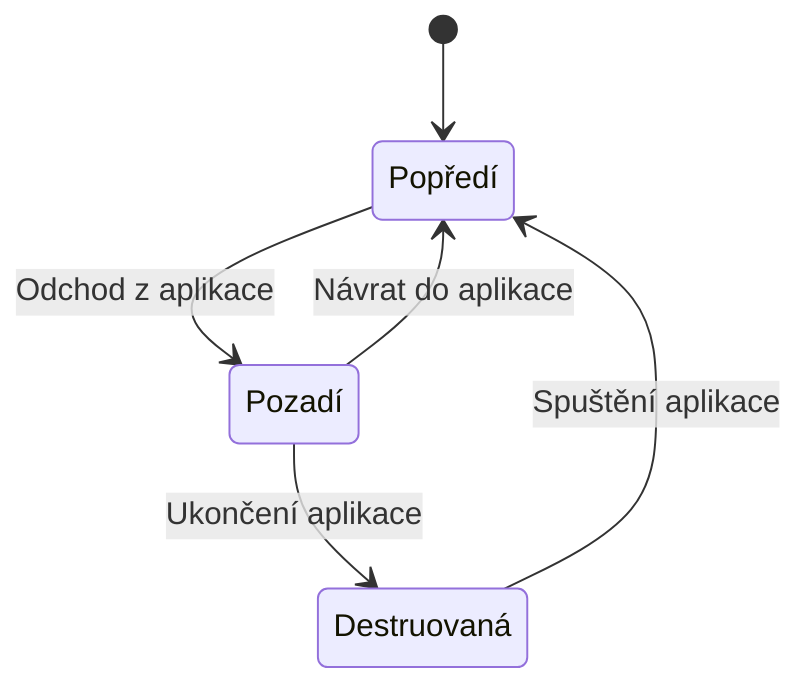

## Programování pro mobilní platformy

### Užitečné odkazy
- https://ki.ujep.cz/opory/Aplikovana_Informatika/Bc/Programovani_pro_mobilni_platformy.pdf
- https://developer.android.com/guide/components/activities/activity-lifecycle
- https://developer.android.com/develop/core-areas

### Nástroje
- Android Studio, Java

### Požadavky
- jakýkoliv jazyk
- minimálně 2 pohledy (aktivity)
- alespoň 1 přidaná funkcionalita (spolupráce s web service / ukládání do lokálního uložiště / komunikace s SQL / používá GPS, mapy apod.)

### Odlišné chápání pojmu aplikace
- průběžně si uchovává stav a má většinou šanci reagovat na ukončení
- nemá globální stav

### Životní cyklus

### Modul
- synonymum: komponenta
- poskytuje nějakou službu
- druhy:
  - activity (UI pohled)
  - service (krátkodobá činnost na pozadí)
  - content provider (datový zdroj poskytovaný ostatním)
  - observer (např. připojím se k WiFi)
- existuje v zásadě 1 vlákno, na kterém běží
- můžeme si vytvářet vlastní vlákna
- moduly a vlákna jsou ortogonální (ortogonální = dvě vlastnosti jsou na sobě koncepčně nezávislé)
- neexistuje pevné spojení 1 modul = 1 vlákno

### Context
- synonymum: globální identita
- objekt reprezentující aktuální běhové prostředí aplikace
- poskytuje přístup k systémovým službám, zdrojům, databázím, preferencím a umožňuje spouštět další moduly
- každá aktivita je kontext

### Intent
- česky: záměr
- objekt, který popisuje požadovanou akci a případná data potřebná k jejímu provedení
- slouží ke komunikaci mezi moduly
- 2 druhy
  - URL
  - třída (já chci zobrazit třídu této aktivity a zobrazí se konkrétně tato aktivita)

### Resource
- česky: zdroj
- styly, barvy, lokalizace, ikony, ...