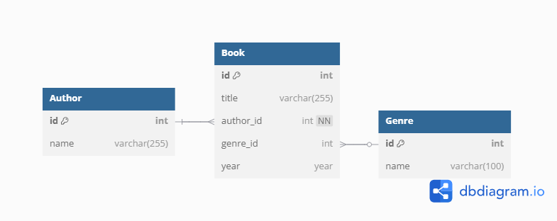

## 📚 BookTracker

Web application for **tracking and rating books**. Users can **browse** a list of books from database, **search and filter** them, **import/export** their **personal reading list** in **XML**, and assign each book a **reading status**, **rating** (0–5 ★), and a **note**.

### ERD Diagram


### Technology
- PHP 8, Apache, MySQL, Docker
- JavaScript, HTML5, CSS3
- XML, XSD, XSLT

### Pages
- `index.php`: navigation
- `list.php`: all books with filtering, search, import/export
- `detail.php`: book detail
- `edit.php`: book update
- `xsl.php`: transformed reading list

### Features
- Search and filter books by title, author, genre, or year
- Track reading status (read, currently reading, want to read)
- Rate books on a 5-star scale with half-star precision
- Add personal notes to books
- Import/export your reading list as XML
- View formatted reading list via XSLT transformation
- XML validation with XSD schema

### Setup

Clone the repository
```
git clone https://github.com/ondrejsvorc/BookTracker.git
cd BookTracker
```

Start Docker containers
```
docker compose up
```

Access the application
- Open your browser and navigate to: http://localhost:8080
- Database will be automatically initialized with sample data

Stop the application
```
docker compose down
```

### Structure
```
📦BookTracker
 ┣ 📂Dockerfiles
 ┃ ┣ 📜Database
 ┃ ┗ 📜WebServer
 ┣ 📂sql
 ┃ ┣ 📜db_diagram.png
 ┃ ┗ 📜init.sql
 ┣ 📂www
 ┃ ┣ 📂includes
 ┃ ┃ ┣ 📜constants.php
 ┃ ┃ ┣ 📜db.php
 ┃ ┃ ┣ 📜functions.php
 ┃ ┃ ┗ 📜layout.php
 ┃ ┣ 📂resources
 ┃ ┃ ┣ 📂xml
 ┃ ┃ ┃ ┣ 📂imported
 ┃ ┃ ┃ ┃ ┗ 📜reading-list.xml
 ┃ ┃ ┃ ┗ 📂static
 ┃ ┃ ┃ ┃ ┣ 📂test
 ┃ ┃ ┃ ┃ ┃ ┣ 📜invalid-missing-endtag.xml
 ┃ ┃ ┃ ┃ ┃ ┣ 📜invalid-missing-status.xml
 ┃ ┃ ┃ ┃ ┃ ┣ 📜invalid-rating.xml
 ┃ ┃ ┃ ┃ ┃ ┣ 📜invalid-root.xml
 ┃ ┃ ┃ ┃ ┃ ┣ 📜valid-large.xml
 ┃ ┃ ┃ ┃ ┃ ┗ 📜valid-small.xml
 ┃ ┃ ┃ ┃ ┣ 📜reading-list.xsd
 ┃ ┃ ┃ ┃ ┗ 📜reading-list.xsl
 ┃ ┃ ┗ 📜book.svg
 ┃ ┣ 📜.htaccess
 ┃ ┣ 📜detail.php
 ┃ ┣ 📜edit.php
 ┃ ┣ 📜export.php
 ┃ ┣ 📜import.php
 ┃ ┣ 📜index.php
 ┃ ┣ 📜list.php
 ┃ ┗ 📜xsl.php
 ┣ 📜docker-compose.yml
 ┗ 📜README.md
```