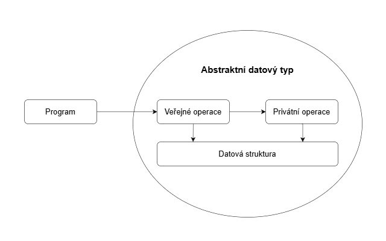

## 1

Základní abstraktní kolekce (jejich klasická implementace \[seznamy, slovníky], iterátory nad nimi, typické elementární operace a jejich časová složitost) a specializované abstraktní kolekce (fronta, zásobník)

### Užitečné odkazy
- https://github.com/pavelberanek91/UJEP/blob/main/APR2/2_sekvencni_struktury.ipynb
- https://ki.ujep.cz/opory/Aplikovana_Informatika/Bc/Algoritmizace_a_programovani_I.html#Seznam
- https://www.geeksforgeeks.org/dsa/abstract-data-types/
- https://medium.com/@tssovi/abstract-data-type-adt-in-python-33e6ce1f961e
- https://bradfieldcs.com/algos/

### Abstraktní kolekce
- datová struktura definovaná atributy a operacemi, ne konkrétní implementací
- typ abstraktního datového typu
- popisuje:
  - jaká data uchovává (např. prvky typu T),
  - jaké operace podporuje (vložit, smazat, najít, projít),
  - jaké má vlastnosti (uspořádanost, unikátnost klíčů, indexování).
- implementace (pole, spojový seznam, hashovací tabulka…) je oddělená vrstva (určuje složitost operací)

### Druhy abstraktních kolekcí
- sekvenční (seznam)
- množinové (množina)
- asociativní (slovník)
- specializované (fronta, zásobník)

#### Další dělení
- homogenní - všechny prvky kolekce mají stejný datový typ
- heterogenní - prvky mohou mít různé datové typy

### Základní abstraktní kolekce
- seznam (list)
- množina (set)
- slovník (dictionary)
- zásobník (stack)
- fronta (queue)

### Seznam
- sekvenční kolekce
- zachovává pořadí prvků
- umožňuje duplicitní výskyt prvků
- má vždy konečný počet prvků
- nevynucuje setříděnost

#### Typické operace
- zjištění počtu prvků
- přístup k prvku na určité pozici
- vložení prvku na určitou pozici
- odstranění prvku z určité pozice
- nahrazení prvku

#### Typické implementace
- pole (statické/dynamické, jednorozměrné/vícerozměrné)
- spojový seznam (jednosměrný, obousměrný)

#### Statické pole
- souvislý blok paměti pevné velikosti
- velikost je určena při vytvoření a nelze ji změnit
- prvky jsou uloženy vedle sebe
- podporuje náhodný přístup podle indexu

#### Dynamické pole
- interně používá statické pole jako úložiště
- pokud velikost přesáhne kapacitu, dojde k rozšíření a realokaci
- kapacita roste geometricky (např. ×2)

### Množina
- kolekce unikátních prvků
- neumožňuje duplicitní výskyt prvků
- nemá definované pořadí
- nemá index
- dvě množiny jsou stejné, pokud obsahují stejné prvky, bez ohledu na pořadí
- musí umět rozhodnout kdy jsou dva prvky stejné (operátor rovnosti)

#### Typické operace
- vložení prvku
- odstranění prvku
- test existence prvku
- zjištění velikosti
- sjednocení, průnik, rozdíl

#### Typické implementace
- hashovací tabulka
- vyvážený strom

#### Hashovací tabulka
-

### Slovník
- ukládá dvojice (klíč -> hodnota)
- klíče jsou unikátní
- hodnoty se mohou opakovat
- rovnost slovníků je dána množinou dvojic
- klíč musí být porovnatelný
- u hash implementace musí být klíč hashovatelný

#### Typické operace
- získání hodnoty podle klíče
- odstranění dvojice podle klíče
- vložení nebo aktualizace hodnoty podle klíče
- test existence klíče
- počet dvojic
- iterace přes klíče / hodnoty / dvojice

### Fronta
- anglicky: Queue
- FIFO (First-In-First-Out)

### Zásobník
- anglicky: Stack
- LIFO (Last-In-First-Out)

### Iterátor
- objekt, který poskytuje jednotné rozhraní pro průchod kolekcí bez znalosti její vnitřní implementace

#### Typické operace
- získání aktuálního prvku
- posun na další prvek
- zjištění existence dalšího prvku