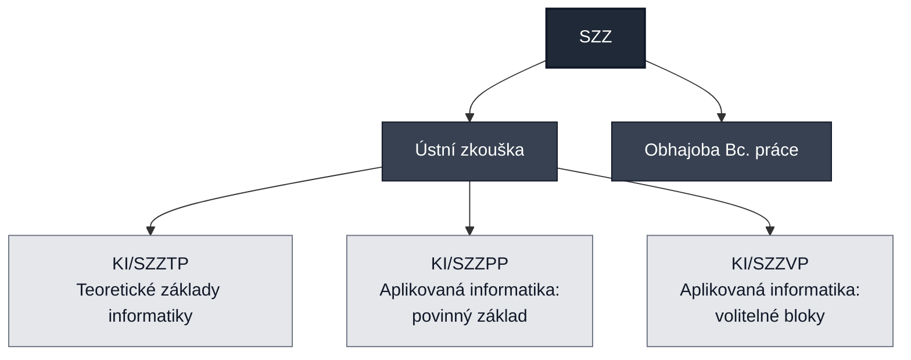
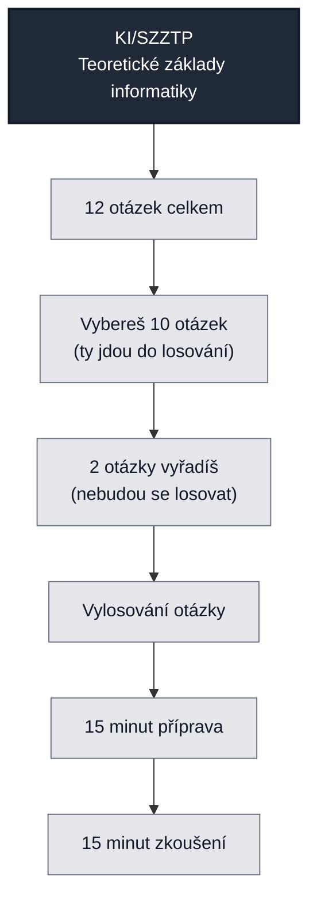
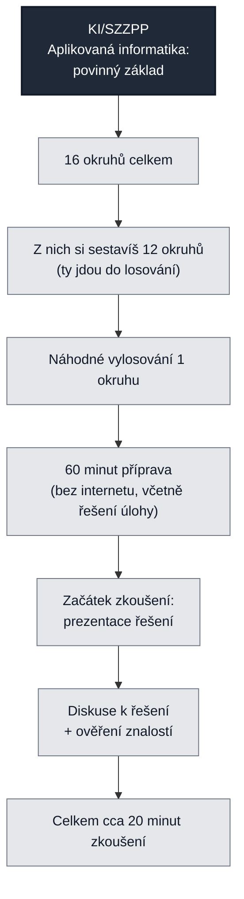
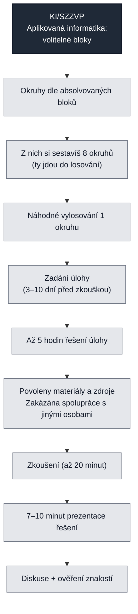

## Státní závěrečná zkouška

Tento repozitář poskytuje informace pro základní orientaci a přípravu na státní závěrečné zkoušky (dále jen SZZ).

### Relevantní zdroje
- https://physics.ujep.cz/~jskvor/SZZ/BcAPI/
- https://github.com/matej-kaska/statnice-oop
- https://github.com/matej-kaska/statnice-frak
- https://github.com/matej-kaska/statnice-tk
- https://github.com/matej-kaska/statnice-rss
- https://github.com/matej-kaska/statnice-web

### Struktura SZZ

### KI/SZZTP Teoretické základy informatiky
#### Algoritmizace a programování I a II
1. Základní abstraktní kolekce (jejich klasická implementace [seznamy, slovníky], iterátory nad nimi, typické elementární operace a jejich časová složitost) a specializované abstraktní kolekce (fronta, zásobník)
1. Komplexní algoritmy nad seznamy (filtrování, vyhledávání, třídění/řazení výběrem nebo vkládáním), efektivnější implementace vyhledávání a třídění (binární vyhledávání, merge sort), časová složitost algoritmů
1. Spojové datové struktury (jednosměrný spojový seznam, binární strom) a základní operace nad nimi (vkládání, výmaz, vyhledávání) včetně časové složitosti
#### Matematika I a II, Numerické metody
1. Reálná funkce jedné reálné proměnné (definice, definiční obor a obor hodnot, graf funkce, limita a spojitost funkce), polynomy (definice, vlastnosti, Hornerovo schéma), numerické řešení nelineárních rovnic (metoda půlení intervalu, Newtonova metoda)
1. Diferenciální a integrální počet funkcí jedné proměnné (definice derivace funkce a její geometrický význam, primitivní funkce, určitý integrál a jeho geometrický význam), numerické derivování a integrace (obdélníkové, lichoběžníkové a Simpsonovo pravidlo), aplikace (určení lokálního extrému, navazování křivek, objem rotačního tělesa)
1. Soustava lineárních rovnic (definice, řešitelnost a Frobeniova věta, metody řešení [Cramerovo pravidlo, Gaussova eliminační metoda, metoda LU rozkladu, Jacobiho a Gaussova‑Seidelova iterační metoda]), aplikace (např. při řešení obvodů stejnosměrného proudu)
Reálná funkce více reálných proměnných (definice, definiční obor a obor hodnot, graf funkce dvou proměnných, parciální derivace, lokální, vázané a globální extrémy), aproximace metodou nejmenších čtverců (motivace a geometrický význam, formulace, řešení, aplikace na nelineární funkce např. v elektronice)
#### Pravděpodobnost a statistika
1. Náhodná veličina a její charakteristiky (distribuční funkce, druhy, pravděpodobnostní funkce vs. hustota pravděpodobnosti, číselné charakteristiky [střední hodnota, rozptyl, kvantily], vybraná diskrétní a spojitá rozdělení pravděpodobnosti)
1. Intervaly spolehlivosti, jejich význam, interpretace a konstrukce (definice, typy, interpretace spolehlivosti, resp. hladiny významnosti, výpočet [pro střední hodnotu, rozptyl, relativní četnost], vliv rozsahu výběru, využití v praxi)
#### Teoretické základy informatiky I a II
1. Výrokový počet (logické spojky, jejich úplný systém, odvozovací pravidla, splnitelnost, aplikace v logických obvodech), predikátový počet (abeceda a konstrukce jazyka), naivní teorie množin (potenční množina, systém množin, operace na množinách, relace mezi množinami), binární relace (vlastnosti a speciální typy [ekvivalence, uspořádání, zobrazení])
1. Rekurence (vymezení, základní metody řešení [iterační a substituční metoda], řešení převodem na algebraické rovnice), speciální funkce (dolní a horní celá část, logaritmy), asymptotická notace (O‑, Theta‑, Omega‑ notace [vztahy a manipulace]), algoritmy (vymezení, Euklidův algoritmus [prvočísla, největší společný dělitel, nejmenší společný násobek])
1. Grafy (definice orientovaného a neorientovaného grafu, jejich vlastnosti a reprezentace, význačné typy grafů), stromy (vymezení a základní charakteristiky, binární stromy a jejich reprezentace), eulerovské a hamiltonovské grafy (eulerovský tah, hamiltonovská kružnice a cesta), prohledávání do hloubky a do šířky

### KI/SZZPP Aplikovaná informatika: povinný základ
- Algoritmizace a programování I a II (https://physics.ujep.cz/~jskvor/SZZ/BcAPI/SZZPP/APR-I-II-3okruhy.pdf, https://physics.ujep.cz/~jskvor/SZZ/BcAPI/SZZPP/Tahaky/APR-Python.pdf)
- Architektura počítačů (https://physics.ujep.cz/~jskvor/SZZ/BcAPI/SZZPP/PCA-I.pdf, https://physics.ujep.cz/~jskvor/SZZ/BcAPI/SZZPP/PCA-II.pdf)
- Základy elektroniky (https://physics.ujep.cz/~jskvor/SZZ/BcAPI/SZZPP/ZEL-2okruhy.pdf, 
- Základy počítačových sítí a protokolů (https://physics.ujep.cz/~jskvor/SZZ/BcAPI/SZZPP/ZPS-A.pdf, https://physics.ujep.cz/~jskvor/SZZ/BcAPI/SZZPP/ZPS-B.pdf, https://physics.ujep.cz/~jskvor/SZZ/BcAPI/SZZPP/Tahaky/ZPS/)
- Matematický software (https://physics.ujep.cz/~jskvor/SZZ/BcAPI/SZZPP/SemiFinal/MSW.pdf)
- Operační systémy (https://physics.ujep.cz/~jskvor/SZZ/BcAPI/SZZPP/OPS.pdf)
- Úvod do relačních databází (https://physics.ujep.cz/~jskvor/SZZ/BcAPI/SZZPP/URDB.pdf, https://physics.ujep.cz/~jskvor/SZZ/BcAPI/SZZPP/Tahaky/URDB-SQL.pdf)
- Základy kyberbezpečnosti (https://physics.ujep.cz/~jskvor/SZZ/BcAPI/SZZPP/ZKB.pdf)
- Základy zpracování dat (https://physics.ujep.cz/~jskvor/SZZ/BcAPI/SZZPP/ZZD.pdf)
- Multimédia a základy počítačové grafiky (https://physics.ujep.cz/~jskvor/SZZ/BcAPI/SZZPP/MPG.pdf)
- Projektové řízení (https://physics.ujep.cz/~jskvor/SZZ/BcAPI/SZZPP/PRIZ.pdf)
  

### KI/SZZVP Aplikovaná informatika: volitelné bloky
- Databázové systémy a zpracování dat (https://physics.ujep.cz/~jskvor/SZZ/BcAPI/SZZVP/SZZVP-DB.pdf)
- Elektronika a automatizace (https://physics.ujep.cz/~jskvor/SZZ/BcAPI/SZZVP/SZZVP-EL.pdf)
- Informační a počítačová bezpečnost (https://physics.ujep.cz/~jskvor/SZZ/BcAPI/SZZVP/SZZVP-SC.pdf, https://physics.ujep.cz/~jskvor/SZZ/BcAPI/SZZVP/SZZVP-ZKR.pdf)
- Operační systémy a virtualizace (https://physics.ujep.cz/~jskvor/SZZ/BcAPI/SZZVP/SZZVP-OS.pdf)
- Počítačové sítě a protokoly (https://physics.ujep.cz/~jskvor/SZZ/BcAPI/SZZVP/SZZVP-CN.pdf)
- Podniková informatika (https://physics.ujep.cz/~jskvor/SZZ/BcAPI/SZZVP/SZZVP-PI.pdf)
- Programování a softwarové inženýrství (https://physics.ujep.cz/~jskvor/SZZ/BcAPI/SZZVP/SZZVP-SW.pdf)

