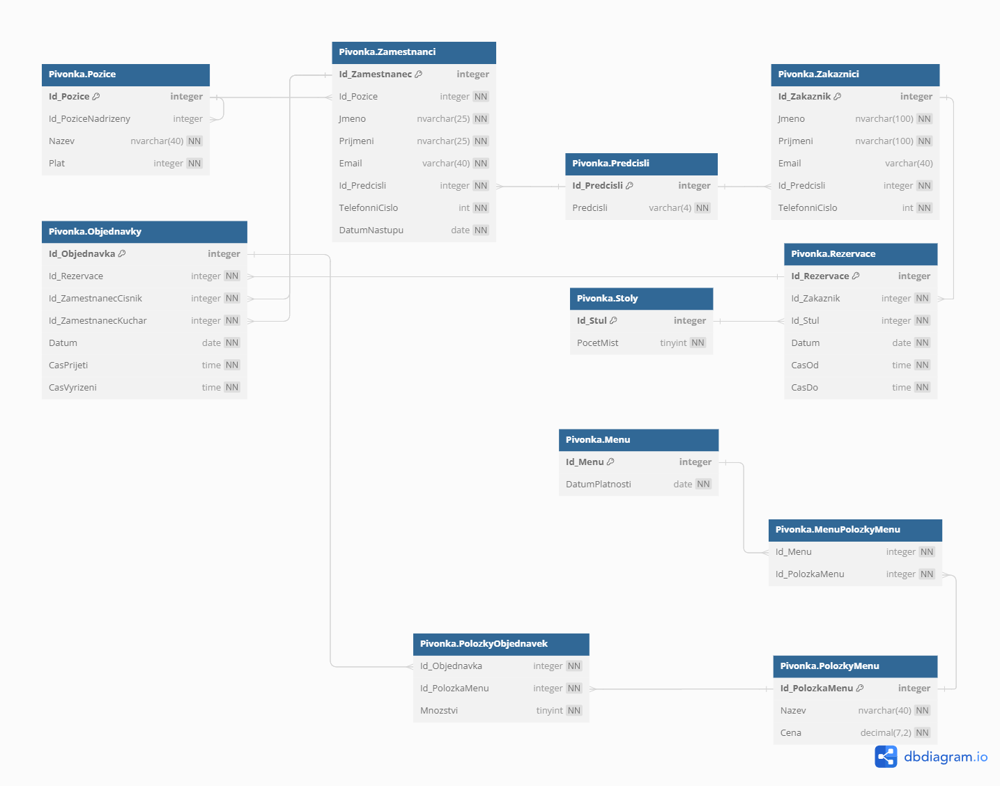

# Databáze restaurace Pivoňka

Tato fiktivní databáze byla navržena pro získání zápočtu k předmětu **Úvod do relačních databází** pro fiktivní restauraci Pivoňka. Obsahuje informace o zaměstnancích, zákaznících, rezervacích, stolech a objednávkách. Databáze obsahuje počáteční data, která simulují provoz restaurace. Pro potřeby zápočtu a následné ústní zkoušky jsem zvolil pro realizaci databáze češtinu, aby se mi o ní lépe hovořilo.

## Struktura
| Tabulka           | Popis                                                                                                |
|-------------------|------------------------------------------------------------------------------------------------------|
| Pozice            | Obsahuje informace o pozicích zaměstnanců, jako je název pozice a plat.                              |
| Predcisli         | Obsahuje telefonní předčíslí jednotlivých zemí.                                                      |
| Zamestnanci       | Uchovává informace o zaměstnancích restaurace, včetně jejich jmen, příjmení, kontaktů a dat nástupu. |
| Zakaznici         | Obsahuje informace o zákaznících, jako jsou jejich jména, příjmení, kontakty a předčíslí telefonů.   |
| Rezervace         | Uchovává údaje o rezervacích stolů zákazníků.                                                        |
| Stoly             | Obsahuje informace o jednotlivých stolících v restauraci.                                            |
| Menu              | Uchovává data o denním menu v restauraci.                                                            |
| PolozkyMenu       | Obsahuje položky, které jsou součástí menu.                                                          |
| MenuPolozkyMenu   | Tabulka sloužící k propojení mezi menu a položkami menu.                                             |
| Objednavky        | Obsahuje informace o objednávkách spojených s rezervacemi.                                           |
| PolozkyObjednavek | Uchovává položky objednávek v restauraci.                                                            |

## Vztahy a omezení
| Omezení                             | Popis                                                                                                                                                   |
|-------------------------------------|---------------------------------------------------------------------------------------------------------------------------------------------------------|
| FK_Zamestnanci_Pozice               | Každý zaměstnanec má právě jednu pozici. Každou pozici může mít více zaměstnanců.                                                                       |
| UQ_Zamestnanci_Email                | Každý zaměstnanec by měl mít unikátní e-mail (odlišný od e-mailu jiných zaměstnanců).                                                                   |
| UQ_Predcisli_Predcisli              | Každé předčíslí by mělo být unikátní (odlišné od jiných předčíslí).                                                                                     |
| FK_Zamestnanci_Predcisli            | Každý zaměstnanec má k telefonnímu číslu právě jedno předčíslí. Každé předčíslí může mít k telefonnímu číslu více zaměstnanců.                          |
| FK_Zakaznici_Predcisli              | Každý zákazník má k telefonnímu číslu právě jedno předčíslí. Každé předčíslí může mít k telefonnímu číslu více zákazníků.                               |
| FK_Pozice_Pozice                    | Ke každé pozici může existovat právě jedna nadřízená pozice (např. Kuchař, Šéfkuchař). Ke každé nadřízené pozici může existovat více podřízených pozic. |
| FK_Rezervace_Stoly                  | Každá rezervace má právě jeden stůl. Každý stůl může být ve více rezervacích (odlišné časy).                                                            |
| FK_Rezervace_Zakaznici              | Každý zákazník může mít více rezervací. Každou rezervaci může mít pouze jeden zákazník.                                                                 |
| FK_Objednavky_Rezervace             | Každá objednávka se pojí právě k jedné rezervaci. Každá rezervace se může vztahovat k více objednávkám (od stolu si objedná více lidí).                 |
| FK_Objednavky_Zamestnanci_Cisnik    | Každá objednávka je obsluhována jedním konkrétním číšníkem. Jeden konkrétní číšník může obsluhovat více objednávek.                                     |
| FK_Objednavky_Zamestnanci_Kuchar    | Každá objednávka je obsluhována jedním konkrétním kuchařem. Jeden konkrétní kuchař může obsluhovat více objednávek.                                     |

## Vlastní funkce
| Funkce                            | Popis                                                                                                 |
|-----------------------------------|-------------------------------------------------------------------------------------------------------|
| JeKucharNeboSefkuchar             | Tato funkce zjišťuje, zda je zaměstnanec kuchařem nebo šéfkuchařem.                                   |
| JeCisnikNeboVrchniCisnik          | Tato funkce zjišťuje, zda je zaměstnanec číšníkem nebo vrchním číšníkem.                              |

## Schéma
